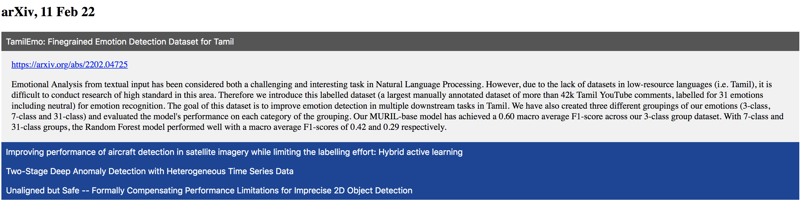

# arxiv-news
See the latest arXiv submissions filtered by keyword. 

Displayed using collapsible HTML buttons - show titles, expand title to show abstract.



# Requirements
```
pip install -r requirements.txt
```

# Usage
```
python3 main.py --keywords [KW1 KW2 ...] --search_title [TITLE]  --search_abstract [ABSTRACT]
```
where
- `KW1 KW2 ...`: space-separated keywords;
- `TITLE`: whether to search titles, `strtobool` format (see below);
- `ABSTRACT`: whether to search abstracts, `strtobool` format (see below);

`distutils.util.strtobool()` evaluates inputs to boolean: `{y,yes,t,true,on,1}` evaluate to `True` while `{n,no,f,false,off,0}` evaluate to `False`;

# Example
To search for articles containing the keyword *detection* in the *title* but not in the *abstract* use:
```
python3 main.py --keywords detection --search_title yes --search_abstract no
```

# Extensions
Currently 'new' (today's) articles in the 'cs' domain are searched. 

- Extend search:
  - others domains instead of 'cs', (e.g. 'stat'); or subdomains (e.g. 'cs.LG'/'cs.CV');
  - other horizons instead of 'new' (e.g. 'pastweek', https://arxiv.org/list/cs/pastweek?skip=0&show=2000);
- Dynamic search:
  - have a dynamic html page to perform the search (tools: FastAPI);
- Automate search:
  - schedule running the script;
  - upload/publish/email search results;

# Tools
**Web Scrapping**: BautifulSoup, HTML-CSS
