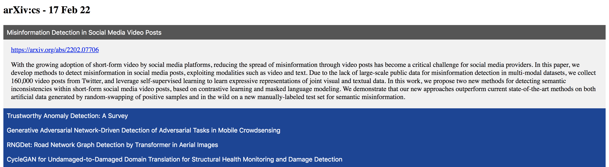

# arXiv-filter

See the latest arXiv submissions filtered by keywords.

Displayed using collapsible HTML buttons.

### Collapsed view (shows title only):


### Expanded view (shows title and abstract):


# Requirements
```
pip install -r requirements.txt
```

# Usage
```
python main.py
  --keywords [kw1 kw2 ...] 
  --channel [ch]
  --search_title [y/n]  
  --search_abstract [y/n]
```
where
- `--keywords`: space-separated keywords;
- `--channel`: the arXiv channel to search ('cs', 'cs.CV', 'stat', ...);
- `--search_title`: whether to search titles, `strtobool` format (see below);
- `--search_abstract`: whether to search abstracts, `strtobool` format (see below);

The code uses `bool(distutils.util.strtobool(x))`, which evaluates input `x` to boolean: 
- `{y,yes,t,true,on,1}` evaluate to `True`;
- `{n,no,f,false,off,0}` evaluate to `False`;

# Example
To search for articles containing the keyword *detection* in the *title* but not in the *abstract* use:
```
python3 main.py --keywords detection --channel cs.CV --search_title yes --search_abstract no
```
or with short arguments:
```
python3 main.py --kw detection --ch cs.CV --st y --sa n
```

# Development

### Todo
- Extend search:
  - other horizons instead of 'new' (e.g. 'pastweek', https://arxiv.org/list/cs/pastweek?skip=0&show=2000);
- Dynamic search:
  - have a dynamic html page to perform the search (tools: FastAPI);
- Automate search:
  - schedule running the script;
  - upload/publish/email search results;

# Tools
Web Scrapping, BautifulSoup, HTML
