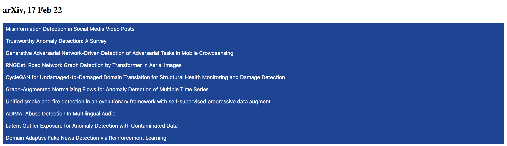
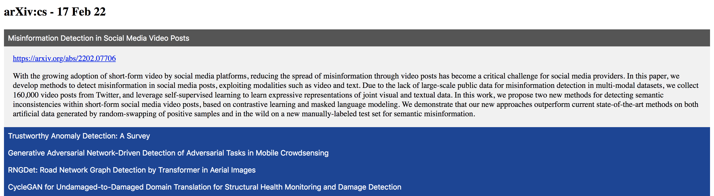

# arxiv-news
See the latest arXiv submissions filtered by keyword. 

Displayed using collapsible HTML buttons - show titles by default, expand title to show abstract and link - as displayed below.

**============== Collapsed ==============**

**============== Expanded ==============**


# Requirements
```
pip install -r requirements.txt
```

# Usage
```
python3 main.py
  --keywords [kw1 kw2 ...] 
  --channel [ch]
  --search_title [y/n]  
  --search_abstract [y/n]
```
where
- `--keywords`: space-separated keywords;
- `--channel`: the arXiv channel to search ('cs', 'cs.CV', 'stat', ...);
- `--search_title`: whether to search titles, `strtobool` format (see below);
- `--search_abstract`: whether to search abstracts, `strtobool` format (see below);

`bool(distutils.util.strtobool(x))` evaluates input `x` to boolean: 
- `{y,yes,t,true,on,1}` evaluate to `True`;
- `{n,no,f,false,off,0}` evaluate to `False`;

# Example
To search for articles containing the keyword *detection* in the *title* but not in the *abstract* use:
```
python3 main.py --keywords detection --channel cs.CV --search_title yes --search_abstract no
```

# Extensions
Currently 'new' (today's) articles in the 'cs' domain are searched. 

- Extend search:
  - other horizons instead of 'new' (e.g. 'pastweek', https://arxiv.org/list/cs/pastweek?skip=0&show=2000);
- Dynamic search:
  - have a dynamic html page to perform the search (tools: FastAPI);
- Automate search:
  - schedule running the script;
  - upload/publish/email search results;

# Tools
Web Scrapping, BautifulSoup, HTML/CSS

# References
- :information_source: arXiv: https://arxiv.org
- :information_source: BautifulSoup: https://beautiful-soup-4.readthedocs.io/en/latest

